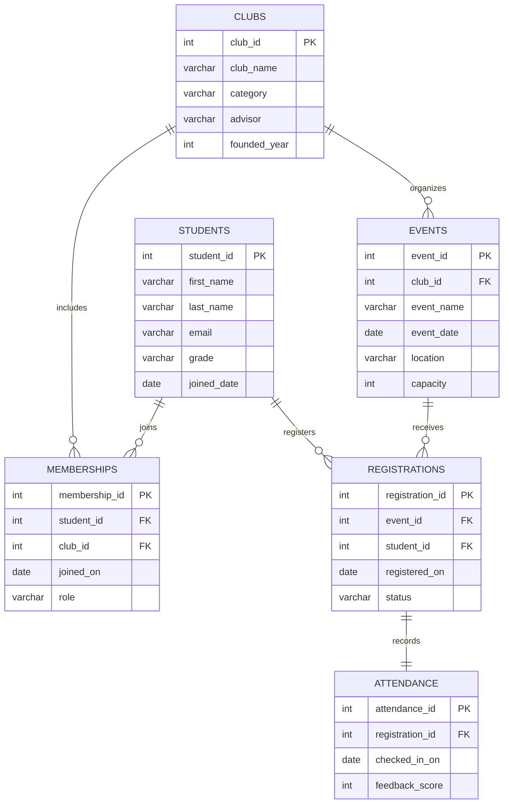

# Design Document

By Maroof Hassan

Video overview: (https://youtu.be/4Zs1pZSBelg)

## Scope

### Purpose
ClubSphere is a database system created to help schools and universities manage their student clubs, events, and registrations efficiently.
The purpose is to provide an organized structure for tracking student participation, club memberships, and event attendance without relying on manual spreadsheets or paper-based systems.

### Included in Scope
This database includes:
- Students — individuals registered at the institution.
- Clubs/Societies — active student-led organizations.
- Memberships — connections between students and clubs.
- Events — activities hosted by clubs.
- Registrations — signups for events by students.
- Attendance — records of students who checked into events.

Each of these entities interacts to form a complete ecosystem that reflects how real-world student organizations operate.

### Outside the Scope
The following features are not included:
- User authentication and login systems.
- Payment gateways or ticketing integrations.
- Automatic email reminders or notifications.
- Front-end or web application interfaces (this project focuses purely on the SQL backend).

---

## Functional Requirements

### What Users Can Do
Using this database, a user (e.g., club administrator or system manager) can:
- Add, edit, or remove student, club, and event records.
- Assign students to clubs through memberships.
- Record event registrations and attendance.
- Query the database to:
  - View all clubs and their member counts.
  - Find which students registered for or attended a given event.
  - Determine the most active clubs or students.
  - Track upcoming events and their capacities.

### Beyond the Scope
Users cannot:
- Perform authentication or role-based access.
- Enforce automatic event capacity limits (must be handled manually or via external logic).
- Record payments or external sponsorships.
- Manage staff or non-student participants.

---

## Representation

### Entities

#### 1. Students
- Attributes:
  `student_id` (PK), `first_name`, `last_name`, `email`, `grade`, `joined_date`
- Types and Constraints:
  - `student_id` is an auto-incrementing integer (unique identifier).
  - `email` is unique to prevent duplicate student records.
  - `joined_date` defaults to the current date for new entries.
  - All names stored as `TEXT` for flexibility across character sets.

#### 2. Clubs
- Attributes:
  `club_id` (PK), `club_name`, `category`, `advisor`, `founded_year`
- Rationale:
  Each club must have a unique ID. The `category` allows grouping (e.g., “STEM,” “Arts”). `advisor` and `founded_year` provide historical context.

#### 3. Memberships
- Attributes:
  `membership_id` (PK), `student_id` (FK), `club_id` (FK), `joined_on`, `role`
- Constraints:
  - Links students and clubs via foreign keys.
  - Ensures referential integrity (students and clubs must exist first).
  - Default role is “Member” to simplify insertion.
  - `ON DELETE CASCADE` ensures that if a student or club is removed, all related memberships are also removed.

#### 4. Events
- Attributes:
  `event_id` (PK), `club_id` (FK), `event_name`, `event_date`, `location`, `capacity`
- Rationale:
  - Each event belongs to one club.
  - `capacity` allows tracking the maximum participants.
  - Deleting a club cascades to its events.

#### 5. Registrations
- Attributes:
  `registration_id` (PK), `event_id` (FK), `student_id` (FK), `registered_on`, `status`
- Constraints:
  - Links events and students.
  - Default `status` is “Registered.”
  - Ensures every registration corresponds to a valid student and event.

#### 6. Attendance
- Attributes:
  `attendance_id` (PK), `registration_id` (FK), `checked_in_on`, `feedback_score`
- Constraints:
  - Connected to a single registration record.
  - `feedback_score` restricted between 1 and 5 using a CHECK constraint.
  - `ON DELETE CASCADE` ensures related attendance data is deleted automatically.

---

### Relationships

#### Overview
- Students ↔ Clubs — many-to-many via `Memberships`
- Clubs ↔ Events — one-to-many
- Students ↔ Events — many-to-many via `Registrations`
- Registrations ↔ Attendance — one-to-one

#### Entity Relationship Diagram

#### Optimizations

To make the ClubSphere database efficient and reliable, several optimizations were implemented:

1. Indexes
   - Indexes were created on foreign key columns such as `student_id`, `club_id`, `event_id`, and `registration_id`.
   - These indexes significantly improve the speed of `JOIN` and `SELECT` queries, especially when filtering by specific clubs, students, or events in large datasets.

2. Foreign Key Constraints
   - Each relationship uses foreign key constraints with `ON DELETE CASCADE` to ensure referential integrity.
   - This means that when a student, club, or event is deleted, all related records in linking tables are automatically removed, preventing orphaned rows.

3. Normalization
   - The database design follows Third Normal Form (3NF) to eliminate redundancy and maintain data consistency.
   - For example, club names are stored only once in the `clubs` table rather than being repeated in every event record.

4. Potential Views (for future extension)
   - The schema allows for optional SQL views such as:
     - `active_members_view`: showing all currently active memberships.
     - `event_summary_view`: aggregating total registrations and attendance per event.
   - These would help simplify complex analytical queries without duplicating logic.

---

## Limitations

Although the design is efficient, scalable, and normalized, there are several limitations that define what it cannot represent perfectly:

1. No Automatic Capacity Enforcement
   - The database does not automatically prevent over-registration for events that exceed their capacity.
   - A trigger or application-level logic would be needed to handle that.

2. No Role-Based Permissions
   - All users are treated equally; there is no distinction between administrators, club presidents, or regular members.

3. Limited Feedback Representation
   - Feedback is stored as a numeric score (1–5) only. The system cannot capture written or detailed comments from participants.

4. Manual Attendance Validation
   - Attendance data relies on manual check-ins. There is no built-in validation mechanism for confirming whether a participant actually attended.

5. No Integration with External Systems
   - The design does not support payments, notifications, or calendar scheduling.
   - These could be added later through external applications or APIs.

### Potential Future Improvements
- Add SQL triggers to automatically prevent registrations when event capacity is full.
- Create stored procedures for generating reports such as the most active students or most popular clubs.
- Introduce a roles and permissions system for club management.
- Add text-based feedback and comment tracking for post-event analysis.
- Implement views for quick summaries of total members, event counts, and attendance rates.
